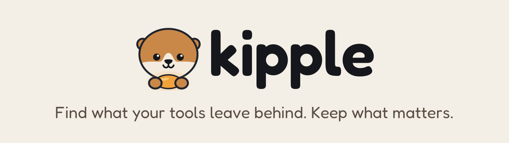

<p align="center">
  <picture>
    <source media="(prefers-color-scheme: dark)" srcset="assets/brand/banner-dark.svg">
    
  </picture>
</p>

# kipple

> Kipple: useless stuff that piles up by itself when nobody is looking. A word popularized by Philip K. Dick.

kipple finds what your tools leave behind, explains what each thing is and what you lose by removing it, and removes what is safe to remove, with a record of everything it did. It is a fast, cross-platform CLI and TUI written in Rust for Linux, macOS and Windows. It knows the footprint of coding agents (Claude Code, Codex, Pi, Cursor) and developer toolchains, and you can extend it with declarative rule packs.

**Status: M1 (core model and read-only scan), in progress.** The engine, the platform probes and `kipple doctor` exist: `doctor` shows where kipple looks, what it can read, which native tools it found and how many running programs it can identify. Scanning arrives next. The docs below are the plan, with a status line on each.

## Development

Install the gate tools at the versions pinned in [Decisions](docs/decisions.md) §2 (`cargo-nextest`, `cargo-deny`, `cargo-machete`, `typos-cli`), then:

```sh
cargo xtask check                    # the gate: green here is green
cargo xtask fix                      # clippy fixes, then rustfmt
cargo xtask check-arch               # crate boundaries only
cargo xtask gen-docs                 # regenerate the CLI reference
cargo xtask bench-tree <dir> --entries 100000  # benchmark reference tree
cargo xtask test-native              # native-backend tests: disposable hosts only (KIPPLE_TEST_DISPOSABLE_HOST=1)
git config core.hooksPath .githooks  # pre-commit: fmt, clippy, typos
```

## Docs

| Doc | What it covers |
| --- | --- |
| [Product vision](docs/01-product-vision.md) | Problem, evidence, positioning, principles, non-goals, name |
| [Market research](docs/02-market-research.md) | Mole and the landscape, gaps, plugin precedents |
| [Functional spec](docs/03-functional-spec.md) | Vocabulary, journeys, CLI, TUI, output contracts, exit codes, config |
| [Safety model](docs/04-safety-model.md) | Authority, invariants, methods, accounting, release gates |
| [Architecture](docs/05-architecture.md) | Crates, ports, engine API, events, performance, GUI reuse |
| [Integrations and rules](docs/06-adapters-and-rules.md) | Two-layer model, rule schema v1, hard cases, v0.1 catalog |
| [Rule packs](docs/07-plugins.md) | Remote packs, grants, registry, authoring |
| [Engineering standards](docs/08-engineering-standards.md) | Gate, lints, architecture checks, test philosophy |
| [Site and docs](docs/09-site-and-docs.md) | Landing page, docs site, generated references |
| [CI and release](docs/10-ci-and-release.md) | CI matrix, release pipeline, channels, signing |
| [Delivery plan](docs/11-delivery-plan.md) | Spikes, milestones M0–M7, roadmap |
| [Decisions](docs/decisions.md) | Decision log and candidate dependency versions |
| [Product context](PRODUCT.md) | Users, positioning, voice and brand commitments for design work |
| [Brand](assets/brand/BRAND.md) | Kip the otter, logo files, colours, rules |

## License

MIT. See [LICENSE](LICENSE).
